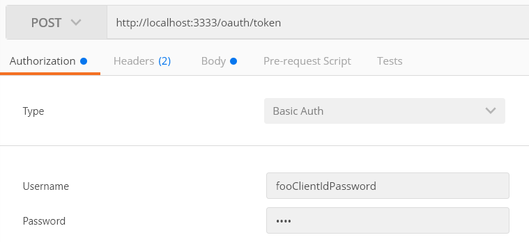
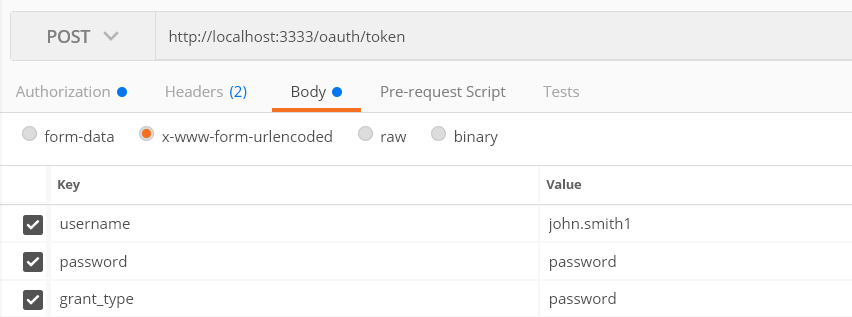

# appointments
## Developer notes
### To set up the authentication server in a Java IDE...
- Ensure [Java 8](http://www.oracle.com/technetwork/java/javase/downloads/index.html), [Git](https://git-scm.com/downloads) and [Maven](https://maven.apache.org/download.cgi) are installed and set-up on your machine (including your Java IDE of choice e.g. Eclipse)
 - Clone the [auth-server repository](https://github.com/gpit-futures/auth-server.git) using git clone (or your favourite GUI tool) using the URL https://github.com/gpit-futures/auth-server.git to an appropriate local directory.
 - Import the project into your IDE as a Maven project.  The pom.xml file containing the build configuration required for import can be found in the local directory created above.
### To run via the Java IDE
 - The main class is com.answerdigital.gpit.authserver.AuthorisationServer.  Simply run this class as a standard Java application.
 ### To run via an executable JAR file
 - In a console, Navigate to the root directory of the auth-server project as defined above (the directory containing the pom.xml file).
 - Build the project using the 'mvn clean install' command.
 - The JAR file to execute can be found in the /target directory.
### Dependencies
- A working version of the [framework](https://github.com/gpit-futures/frame) for logging in. Not strictly necessary as can use tools such as Postman to request tokens (configuration shown below).

### Configuration
All configuration for the application can be found in... 
**{root_directory}/src/main/resources/authorisation-server.yml**

**Please do not change any of the configuration apart from possibly the port on which the auth-server is listening for connections otherwise authentication will fail**
## Installation notes
To install the auth-server directly simply download the latest version of the [framework](https://github.com/gpit-futures/frame/releases) from Git Hub and login as either user.  
